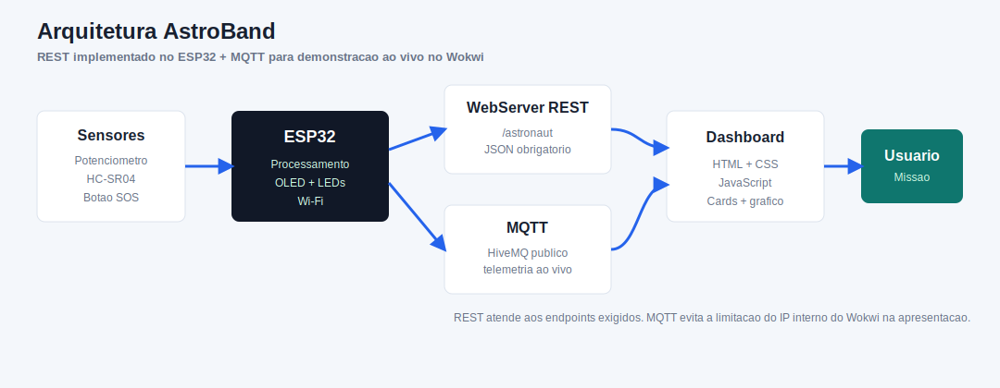
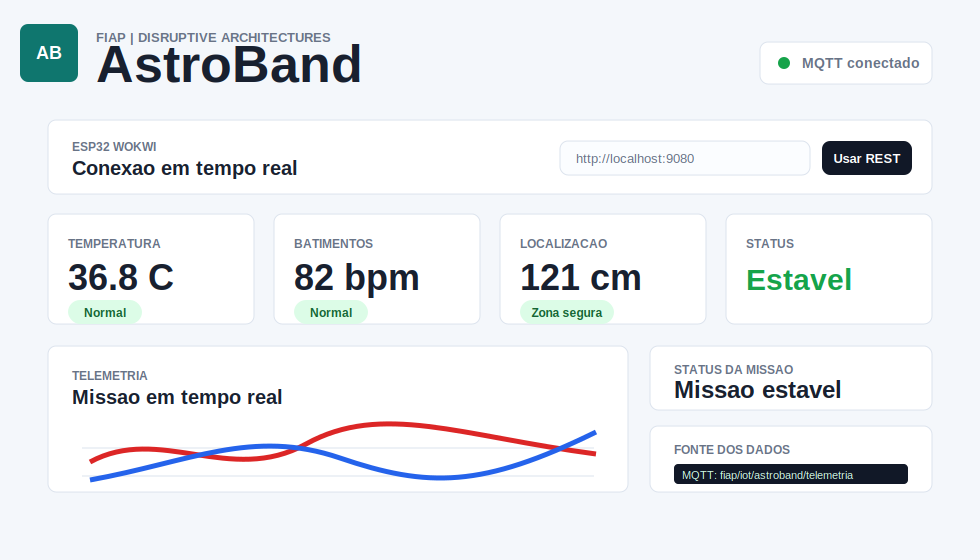

# AstroBand - Pulseira inteligente para astronautas

Projeto academico desenvolvido para a disciplina **Disruptive Architectures: IoT, IoB & Generative IA - FIAP**, inspirado na abordagem dos laboratorios oficiais da disciplina: prototipacao simples, componentes acessiveis, ESP32, Wokwi, API REST embarcada e visualizacao de dados em dashboard.

## Informacoes do projeto

**Nome:** AstroBand  
**Desafio:** Conectar exploracao espacial com problemas e oportunidades reais aqui na Terra  
**Tipo:** Prova de conceito IoT simulada  
**Plataforma:** ESP32 no Wokwi  
**Interface:** Dashboard Web responsivo com API REST implementada e MQTT para demonstracao ao vivo no Wokwi

## 1. Descricao do problema

Missoes espaciais exigem acompanhamento continuo de sinais vitais, posicao e eventos criticos dos astronautas. Em ambientes extremos, uma pequena alteracao de temperatura corporal, batimentos cardiacos ou localizacao pode indicar risco operacional.

Esse mesmo problema tambem existe na Terra em atividades de alto risco, como resgate, combate a incendios, mineracao, operacao em plataformas de petroleo e atuacao em areas remotas. Profissionais expostos a calor, baixa visibilidade, isolamento ou risco fisico precisam ser monitorados em tempo real.

## 2. Solucao proposta

A **AstroBand** e uma pulseira inteligente simulada para monitoramento de astronautas. O prototipo utiliza um ESP32 no Wokwi para coletar dados, classificar o status da missao, exibir informacoes em um display OLED e disponibilizar uma API REST local para um dashboard web.

A prova de conceito nao utiliza sensores medicos reais. O foco e demonstrar corretamente os conceitos de IoT: sensores, atuadores, conectividade, interface local, API REST, dados em JSON e visualizacao em dashboard.

## 3. Relacao entre exploracao espacial e aplicacao terrestre

A exploracao espacial cria solucoes para ambientes hostis, com alta exigencia de confiabilidade, telemetria e tomada de decisao rapida. A AstroBand adapta esse conceito para a Terra, permitindo monitoramento remoto de:

- Bombeiros em operacoes de resgate.
- Trabalhadores em minas.
- Equipes em plataformas de petroleo.
- Profissionais em areas contaminadas.
- Operadores em ambientes extremos.
- Equipes de busca em locais isolados.

## 4. Arquitetura IoT



Fluxo principal:

1. O potenciometro simula a temperatura corporal.
2. O HC-SR04 simula distancia/localizacao.
3. O botao simula emergencia manual.
4. O ESP32 processa os dados e aciona LEDs.
5. O display OLED mostra as quatro telas locais.
6. O WebServer embarcado expoe endpoints REST em JSON.
7. O dashboard consome a API e atualiza os cards em tempo real.

## 5. Fluxo dos dados

```text
Sensores
  ↓
ESP32
  ↓
WebServer REST
  ↓
Dashboard Web
  ↓
Usuario
```

## 6. Componentes utilizados

| Componente | Funcao |
|---|---|
| ESP32 DevKit | Controlador IoT e WebServer REST |
| Potenciometro | Simula temperatura corporal |
| HC-SR04 | Simula distancia/localizacao do astronauta |
| Push button | Simula botao de emergencia |
| LED vermelho | Simula batimentos cardiacos |
| LED azul | Indica status da missao |
| Display OLED SSD1306 | Interface local da AstroBand |
| Resistores | Protecao dos LEDs |

## 7. Endpoints da API

O ESP32 executa um WebServer na porta `80`. O IP aparece no Monitor Serial do Wokwi apos a conexao Wi-Fi.

### GET `/heartbeat`

```json
{
  "heartbeat": 78,
  "status": "normal"
}
```

### GET `/temperature`

```json
{
  "temperature": 36.7,
  "status": "normal"
}
```

### GET `/location`

```json
{
  "distance": 120,
  "status": "safe"
}
```

### GET `/astronaut`

```json
{
  "heartbeat": 78,
  "temperature": 36.7,
  "distance": 120,
  "emergency": false,
  "status": "normal"
}
```

## 8. Estrutura de pastas

```text
astroband
├── README.md
├── src
│   └── sketch.ino
├── wokwi
│   ├── diagram.json
│   ├── libraries.txt
│   ├── sketch.ino
│   └── wokwi.toml
├── dashboard
│   ├── index.html
│   ├── script.js
│   └── style.css
├── docs
│   ├── arquitetura.md
│   ├── arquitetura.svg
│   ├── dashboard-preview.svg
│   ├── documentacao-tecnica.md
│   ├── perguntas-respostas.md
│   └── roteiro-apresentacao.md
└── video
    └── Link do Video.txt
```

## 9. Como executar no Wokwi

1. Acesse o Wokwi.
2. Crie um novo projeto com ESP32.
3. Copie o conteudo de `wokwi/sketch.ino` para o codigo Arduino.
4. Copie o conteudo de `wokwi/diagram.json` para o diagrama.
5. Garanta que as bibliotecas de `wokwi/libraries.txt` estejam disponiveis.
6. Inicie a simulacao.
7. Abra o Monitor Serial.
8. Copie o IP exibido na linha `IP do ESP32`.

## 10. Como executar o dashboard

1. Abra o arquivo `dashboard/index.html` no navegador.
2. Inicie a simulacao do ESP32 no Wokwi.
3. Aguarde o status `MQTT conectado`.
4. Os cards de temperatura, batimentos, localizacao, status e emergencia serao atualizados em tempo real.
5. Caso esteja usando o Wokwi Private IoT Gateway, tambem e possivel informar `http://localhost:9080` e clicar em **Usar REST**.

Observacao importante: o ESP32 mantem a API REST obrigatoria, mas o Wokwi publico nao permite que o navegador acesse diretamente o WebServer interno pelo IP `10.10.0.2`. Por isso, para demonstracao ao vivo sem gateway pago, o projeto tambem publica a telemetria via MQTT publico, mantendo o dashboard funcional durante a apresentacao.

Previa visual:



## Interface OLED

O display OLED alterna automaticamente entre quatro telas:

| Tela | Informacao |
|---|---|
| 1 | BATIMENTOS |
| 2 | TEMPERATURA |
| 3 | LOCALIZACAO |
| 4 | STATUS DA MISSAO |

## Regras de alerta

| Regra | Resultado |
|---|---|
| Temperatura maior ou igual a `38.0 C` | Status critico |
| Distancia maior que `150 cm` | Atencao |
| Distancia maior que `220 cm` | Fora da zona |
| Batimentos acima de `100 bpm` | Atencao |
| Batimentos acima de `120 bpm` | Critico |
| Botao pressionado | Emergencia |

## 11. Integrantes

- Nome do integrante 1 - RM
- Nome do integrante 2 - RM
- Nome do integrante 3 - RM

## 12. Link do video

Adicionar link do video da apresentacao.

## 13. Link do GitHub

Adicionar link do repositorio GitHub.

## Relacao com a disciplina

O projeto segue a linha didatica apresentada no material oficial de **Disruptive Architectures**, que destaca IoT como integracao entre sensores, atuadores, conectividade, protocolos, arquitetura e visualizacao de dados. A entrega tambem respeita a dinamica de laboratorios praticos, com foco em prototipo funcional, comunicacao em rede e codigo compreensivel para estudantes.

Referencia conceitual: https://arnaldojr.github.io/DisruptiveArchitectures/

## Possiveis melhorias futuras

- Adicionar historico em banco de dados.
- Criar autenticacao para acesso ao dashboard.
- Monitorar multiplos astronautas ou trabalhadores.
- Integrar GPS real em uma versao fisica.
- Enviar notificacoes por aplicativo mobile.
- Adicionar analise preditiva com IA generativa para relatorios de missao.

## Observacao

Este projeto e uma prova de conceito academica. Os dados de saude sao simulados e nao devem ser usados para monitoramento medico real.
